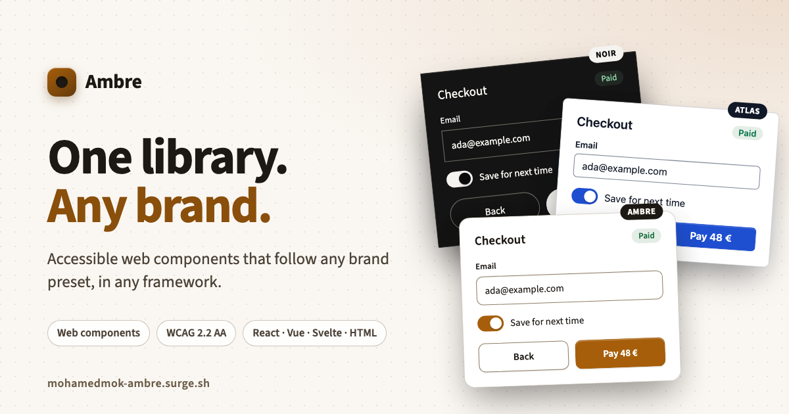

<p align="center">
  <a href="https://mohamedmok-ambre.surge.sh">
    
  </a>
</p>

<h1 align="center">Ambre</h1>

<p align="center">
  <strong>One library. Any brand.</strong><br />
  Accessible web components that follow any brand preset, in any framework.
</p>

<p align="center">
  <a href="https://www.npmjs.com/package/@ambre-ds/ui"></a>
  <a href="https://github.com/mohamedMok/ambre/actions/workflows/ci.yml"></a>
  <a href="https://mohamedmok-ambre.surge.sh/foundations/accessibility"></a>
  
  <a href="LICENSE"></a>
</p>

<p align="center">
  <a href="https://mohamedmok-ambre.surge.sh">Documentation</a> ·
  <a href="https://mohamedmok-ambre.surge.sh/builder">Preset builder</a> ·
  <a href="https://mohamedmok-ambre.surge.sh/storybook/">Storybook</a> ·
  <a href="https://mohamedmok-ambre.surge.sh/get-started/events">Events</a> ·
  <a href="CONTRIBUTING.md">Contributing</a>
</p>

---

## Why Ambre

- **A brand is one file.** Colour, type, radius, space, control size, focus, motion, and depth are semantic tokens. Swap the preset and every component follows, with no change to the markup. Five brands ship in the box, and the [preset builder](https://mohamedmok-ambre.surge.sh/builder) makes yours: edit any of the 86 tokens or roll one at random, watch every component live, and export the file.
- **Works everywhere.** Standard custom elements with open shadow roots. The same tags run in React, Vue, Svelte, Angular, and plain HTML, and form controls join a native `<form>` through `ElementInternals`.
- **Accessible by contract.** WCAG 2.2 AA is the floor. Native roles, the APG keyboard patterns, visible focus, reduced motion, and forced colors are built in. 40 contrast pairs are checked in every brand and theme on every build.
- **An API you can trust.** Every component has a contract: props, slots, events with their `detail`, parts, and tokens. CI fails when the code drifts from it, and the manifest and TypeScript types are generated from it.
- **Ready for AI products.** `@ambre-ds/ai` ships the composer, streaming messages, a thinking state, agent steps, code blocks, and suggestions.
- **Written correctly by AI tools.** An [MCP server](https://mohamedmok-ambre.surge.sh/get-started/ai) (`npx -y @ambre-ds/mcp`) gives Claude, Cursor, and Copilot the exact API of every element and validates the markup they write. The same reference is at [`/llms.txt`](https://mohamedmok-ambre.surge.sh/llms.txt), with a usage skill and [complete examples](https://mohamedmok-ambre.surge.sh/examples).

## Quick start

```bash
npm install @ambre-ds/tokens @ambre-ds/ui
```

```js
import '@ambre-ds/tokens/css';          // every --amb- variable, light and dark
import '@ambre-ds/tokens/css/presets';  // the brand presets, if you use data-brand
import '@ambre-ds/ui';                  // registers the amb- elements
```

```html
<form action="/subscribe" method="post">
  <amb-text-field name="email" type="email" autocomplete="email" required>Email</amb-text-field>
  <amb-checkbox name="weekly" checked>Send me the weekly digest</amb-checkbox>
  <amb-button type="submit">Subscribe</amb-button>
</form>
```

The visible label is the slotted text. Every event bubbles out of the shadow root with its data in `event.detail`:

```js
document.querySelector('amb-checkbox').addEventListener('change', (event) => {
  console.log(event.detail.checked);
});
```

Pick a brand and a theme on any ancestor:

```html
<html data-brand="atlas" data-theme="dark">
```

Read the full [install guide](https://mohamedmok-ambre.surge.sh/get-started), with the load order, server rendering, and framework notes.

## Packages

| Package | What it carries |
| --- | --- |
| [`@ambre-ds/tokens`](packages/tokens) | DTCG design tokens compiled to CSS variables, Sass, and JSON, with the brand presets |
| [`@ambre-ds/ui`](packages/ui) | The core components |
| [`@ambre-ds/commerce`](packages/commerce) | Shop compositions, starting with quantity |
| [`@ambre-ds/ai`](packages/ai) | Conversation compositions: prompt, message, thinking, suggestion, tool call, code block |
| [`@ambre-ds/mcp`](packages/mcp) | An MCP server for AI agents: component lookup, examples, and a markup validator |

The packages share one version and are published from CI with npm provenance.

## Components

| Group | Elements |
| --- | --- |
| Basics | Button, Link, Disclosure, Icon |
| Forms | Text field, Text area, Checkbox, Radio, Select, Toggle, Range, Date picker, Checkbox card, Radio card |
| Content | Card, Tile, Stat tile |
| Layout | Layout, with the sidebar, split, and stacked frames |
| Feedback | Badge, Tag, Banner, Progress, Spinner, Skeleton, Tooltip |
| Navigation | Breadcrumbs, Pagination, Tabs, Menu, Dialog |
| Commerce | Quantity |
| AI | Prompt, Message, Thinking, Suggestion, Tool call, Code block |

Each has a [documentation page](https://mohamedmok-ambre.surge.sh/components) with a live example, guidance, the API, keyboard and screen reader notes, and its tokens, plus a [Storybook](https://mohamedmok-ambre.surge.sh/storybook/) story for every variant.

## Brands

| Preset | For | Character |
| --- | --- | --- |
| Ambre (default) | Any product | Warm paper and amber, tactile layers |
| `atlas` | Enterprise and data | System face at 14px, 36px controls, ink-blue actions |
| `verdant` | Public services and health | 18px Nunito Sans, 52px controls, AAA text, yellow focus halo |
| `noir` | Luxury and retail | Monochrome ink, square fields, pill actions, slow motion |
| `press` | Editorial and media | Source Serif 4, square corners, hard offset shadows |

A preset is one file in [`packages/tokens/src/preset`](packages/tokens/src/preset). Make your own in the [builder](https://mohamedmok-ambre.surge.sh/builder), or [compare the brands](https://mohamedmok-ambre.surge.sh/brands).

## Frameworks

| Framework | Listen to an event |
| --- | --- |
| HTML and JavaScript | `element.addEventListener('change', …)` |
| React | a ref and `addEventListener`, in React 18 and 19 |
| Vue | `@change="…"`, with `isCustomElement` for `amb-` tags |
| Svelte 5 | `onchange={…}` |
| Angular | `(change)="…"`, with `CUSTOM_ELEMENTS_SCHEMA` |

Register the elements on the client only: `customElements` does not exist on the server. Render the tags and their text on the server, so every label is in the HTML. See [Events](https://mohamedmok-ambre.surge.sh/get-started/events) for each framework.

## How it is built

- Svelte 5 custom elements, compiled to plain JavaScript. The consumer needs no Svelte.
- Styles in Sass, organised by ITCSS and named with BEM, compiled once per element into a shared constructable stylesheet.
- Tokens in the [DTCG 2025.10](https://www.designtokens.org/TR/2025.10/format/) format, built with Style Dictionary. Components read semantic tokens only.
- Decisions are recorded in [`decisions/`](decisions).

```text
packages/tokens     tokens, presets, contrast pairs
packages/ui         core components
packages/commerce   shop compositions
packages/ai         conversation compositions
packages/mcp        knowledge for AI tools: MCP server, validator, llms.txt, skill
contracts           the public API of every component
examples            complete screens, validated in CI
apps/docs           documentation site
apps/storybook      Storybook
decisions           architecture decision records
```

## Develop

Node 22 and pnpm 12.

```bash
pnpm install
pnpm build
pnpm test        # contracts, manifest, and contrast pairs
pnpm docs        # http://localhost:5173
pnpm storybook   # http://localhost:6006
```

Contributions are welcome. Read [CONTRIBUTING.md](CONTRIBUTING.md) first: the contract comes before the code. Agents that work in this repository should read [AGENTS.md](AGENTS.md).

## License

[MIT](LICENSE)
